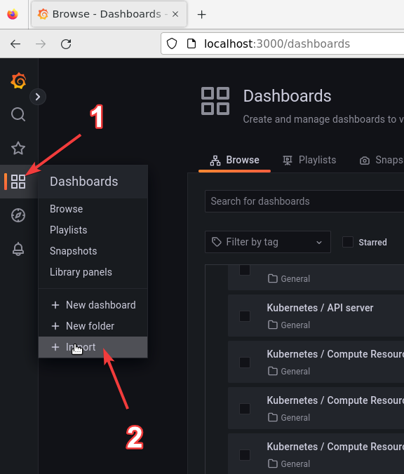

# INSTALLATION <!-- omit in toc -->

## Contents <!-- omit in toc -->

- [Installation](#installation)
  - [Setup nodes](#setup-nodes)
  - [Install Kubernetes](#install-kubernetes)
  - [Network plugin](#network-plugin)
  - [Taint master nodes](#taint-master-nodes)
- [Other components](#other-components)
  - [Helm](#helm)
  - [Default storage](#default-storage)
  - [NVIDIA integration](#nvidia-integration)
  - [Prometheus and Grafana](#prometheus-and-grafana)
    - [NVIDIA exporter](#nvidia-exporter)
  - [Tensorflow training operator](#tensorflow-training-operator)
- [References](#references)

## Installation

This section will show how kubernetes has been deployed at the PIC4SeR centre.

### Setup nodes

The following steps are done on every node.

- Login to the nodes with superuser privileges: `sudo su`
- Turn off swap

  ```bash
  swapoff -a
  sed -i '/ swap / s/^/#/' /etc/fstab
  ```

- Check that required ports are avaiable

  ```bash
  nc -v 127.0.0.1 6443
  ```

- Activate required components for container runtime and networking

  ```bash
  cat <<EOF | tee /etc/modules-load.d/k8s.conf
  overlay
  br_netfilter
  EOF

  modprobe overlay
  modprobe br_netfilter

  cat <<EOF | tee /etc/sysctl.d/k8s.conf
  net.bridge.bridge-nf-call-iptables  = 1
  net.bridge.bridge-nf-call-ip6tables = 1
  net.ipv4.ip_forward                 = 1
  EOF

  sysctl --system
  ```

- Install dependencies

  ```bash
  apt update && apt install -y curl gnupg2 software-properties-common apt-transport-https ca-certificates lsb-release
  ```

- Setup Docker DEB repo

  ```bash
  mkdir -m 0755 -p /etc/apt/keyrings
  curl -fsSL https://download.docker.com/linux/ubuntu/gpg | gpg --dearmor -o /etc/apt/keyrings/docker.gpg

  echo \
    "deb [arch=$(dpkg --print-architecture) signed-by=/etc/apt/keyrings/docker.gpg] https://download.docker.com/linux/ubuntu \
    $(lsb_release -cs) stable" | tee /etc/apt/sources.list.d/docker.list
  ```

- Install containerd

  ```bash
  apt update -y && apt install -y containerd.io
  ```

- Configure containerd

  ```bash
  containerd config default | tee /etc/containerd/config.toml
  ```

  Edit the configuration with any editor. Under the section `[plugins."io.containerd.grpc.v1.cri".containerd.runtimes.runc.options]` change the value for `SystemdCgroup` from `false` to `true`. Then:
  
  ```bash
  systemctl daemon-reload
  systemctl restart containerd
  systemctl enable --now containerd
  ```

- Setup Kubernetes repo

  ```bash
  curl -fsSLo /etc/apt/keyrings/kubernetes-archive-keyring.gpg https://packages.cloud.google.com/apt/doc/apt-key.gpg

  echo "deb [signed-by=/etc/apt/keyrings/kubernetes-archive-keyring.gpg] https://apt.kubernetes.io/ kubernetes-xenial main" | tee /etc/apt/sources.list.d/kubernetes.list
  ```

- Install Kubernetes packages

  ```bash
  apt update
  apt install -y kubelet kubeadm kubectl
  apt-mark hold kubelet kubeadm kubectl
  ```

### Install Kubernetes

Now the cluster needs to be created. A first master endpoint needs to be chosen, in our case the machine called Bonnie.
On this master node run the init command:

```bash
kubeadm init --pod-network-cidr=10.244.0.0/16
```

At the end of the output there are 2 other commands that need to be copy-pasted: one is for making the `kubectl` command avaiable for the user and one (actually two) for joining other nodes. The first is run on the master to make the command available for root user. It looks like this:

```bash
mkdir -p $HOME/.kube
sudo cp -i /etc/kubernetes/admin.conf $HOME/.kube/config
sudo chown $(id -u):$(id -g) $HOME/.kube/config
```

About the join command, there is one for joining master nodes and one for joining worker nodes. The machine Kitt has been chosen for being the second master node, thus the first one has been used.

These join commands use a certificate that expires after 2 hours. If you need to generate another join command, use the following:

- Worker join command:

  ```bash
  kubeadm token create --print-join-command
  ```

- Master join command:

  ```bash
  kubeadm init phase upload-certs --upload-certs
  kubeadm token create --print-join-command
  ```

  There is a part which needs to be added to the command printed out by the token create: `--control-plane --certificate-key <certificate>` where `<certificate>` is the hash provided by the first kubeadm command.

### Network plugin

Now the cluster is running but it's not fully working. With the command `kubectl get nodes` the nodes are marked as NotReady and with `kubectl get pods -n kube-system` is clear that some pods are not running. The reason is that there is no network plugin installed.
In order to clearly see that this is the case, another command can be run: `kubectl describe node <node>` where `<node>` is the name of any node. The output is quite long but there is a `Conditions` section which has a `NetworkUnavailable` type and its status is `True`.

To install Flannel network plugin run the following command:

```bash
kubectl apply -f https://github.com/flannel-io/flannel/releases/latest/download/kube-flannel.yml
```

Now the cluster is set up and it can verified with the commands listed above.

If some nodes are still not ready, run in a shell on those machines:

```bash
sudo systemctl restart containerd kubelet
```

### Taint master nodes

By default K8s doesn't run pods on master nodes. If this is not the wanted behaviour, the following command allow pods to be scheduled on masters too:

```bash
kubectl taint node --all node-role.kubernetes.io/control-plane-
```

## Other components

Now that the cluster is set up, we need to install other components for our use case.

### Helm

Helm is a package manager for K8s.

The Helm project has an installation script that automates the installation:

```bash
curl -fsSL -o get_helm.sh https://raw.githubusercontent.com/helm/helm/main/scripts/get-helm-3
chmod 700 get_helm.sh
./get_helm.sh
```

### Default storage

Data persistence is not provided by default in K8s. In order to have it, a default storage class needs to be created. This class will provide storage from a physical volume that needs to be provided by the cluster administrator. We chose to use a NFS server mainly for allowing the data to be accessible from all the hosts. The NFS server is installed on the machine called Kitt. on the path `/export/kubernetes`.

In order to make the NFS server available to the cluster, the following command needs to be run on the master node:

```bash
helm repo add nfs-subdir-external-provisioner https://kubernetes-sigs.github.io/nfs-subdir-external-provisioner/

helm install nfs-subdir-external-provisioner nfs-subdir-external-provisioner/nfs-subdir-external-provisioner --set nfs.server=kitt2.polito.it --set nfs.path=/export/kubernetes --set storageClass.defaultClass=true
```

Now every PersistentVolumeClaim created in the cluster will be satisfied by the NFS server.

### NVIDIA integration

K8s doesn't allow scheduling GPUs out-of-the-box but this is delegated to vendor's plugins. Instructions for NVIDIA:

- Install container toolkit

  ```bash
  distribution=$(. /etc/os-release;echo $ID$VERSION_ID)
  curl -s -L https://nvidia.github.io/libnvidia-container/gpgkey | sudo apt-key add -
  curl -s -L https://nvidia.github.io/libnvidia-container/$distribution/libnvidia-container.list | sudo tee /etc/apt/sources.list.d/libnvidia-container.list

  sudo apt-get update && sudo apt-get install -y nvidia-container-toolkit
  ```

- Set nvidia as container runtime: open `/etc/containerd/config.toml` and under `[plugins."io.containerd.grpc.v1.cri".containerd]` section change `default_runtime_name` to `"nvidia"`
  
  ```toml
  [plugins."io.containerd.grpc.v1.cri".containerd]
      default_runtime_name = "nvidia"
  ```

  and under the section `[plugins."io.containerd.grpc.v1.cri".containerd.runtimes]` add the following

  ```toml
  [plugins."io.containerd.grpc.v1.cri".containerd.runtimes.nvidia]
    privileged_without_host_devices = false
    runtime_engine = ""
    runtime_root = ""
    runtime_type = "io.containerd.runc.v2"
    [plugins."io.containerd.grpc.v1.cri".containerd.runtimes.nvidia.options]
      BinaryName = "/usr/bin/nvidia-container-runtime"
  ```

- Restart containerd

  ```shell
  sudo systemctl restart containerd
  ```

- ```shell
  helm repo add nvdp https://nvidia.github.io/k8s-device-plugin
  helm repo update

  helm upgrade -i nvdp nvdp/nvidia-device-plugin --namespace nvidia-device-plugin --create-namespace --set gfd.enabled=true
  ```

Now GPU should be avaiable in the cluster. For quickly seeing how many gpus are available, run the command

```shell
kubectl get nodes -o json | jq .items[].status.allocatable
```

It should print something like this

```json
{
  ...
  "nvidia.com/gpu": "2",
  ...
}
{
  ...
  "nvidia.com/gpu": "1",
  ...
}
```

We can see that in this example there are 2 nodes in the cluster, one with 2 gpus and another with 1.

To test if it actually works, we can check the drivers with the following

```shell
cat <<EOF | kubectl apply -f -
apiVersion: v1
kind: Pod
metadata:
  name: gpu-pod
spec:
  restartPolicy: Never
  containers:
    - name: cuda-container
      image: nvcr.io/nvidia/k8s/cuda-sample:vectoradd-cuda10.2
      resources:
        limits:
          nvidia.com/gpu: 1 # requesting 1 GPU
EOF
```

After getting the logs there should be a success message:

```shell
kubectl logs gpu-pod

[Vector addition of 50000 elements]
Copy input data from the host memory to the CUDA device
CUDA kernel launch with 196 blocks of 256 threads
Copy output data from the CUDA device to the host memory
Test PASSED
Done
```

The pod can now be deleted

```shell
kubectl delete pod gpu-pod
```

### Prometheus and Grafana

Prometheus is the state of the art in monitoring K8s clusters, and it ships well with the data visualization tool Grafana which provides dashboards to quickly visualize Prometheus data.

By default, Grafana doesn't persist data, including users and dashboards. To activate persistence, create a file (`prometheus-values.yaml` in this example) with the following content:

```yaml
grafana:
  deploymentStrategy:
    type: Recreate
  persistence:
    enabled: true
  initChownData:
    enabled: false
```

then install the monitoring stack with

```shell
helm repo add prometheus-community https://prometheus-community.github.io/helm-charts
helm repo update

helm install prometheus prometheus-community/kube-prometheus-stack -n prometheus --create-namespace -f prometheus-values.yaml
```

In order to access grafana a port-forward command needs to be running:

```shell
kubectl port-forward svc/prometheus-grafana 3000:80 -n prometheus
```

Now grafana can be accessed through a web browser at `localhost:3000` until the command is stopped with `Ctrl-C`.

The default admin user is `admin` with password `prom-operator`.

#### NVIDIA exporter

In order to visualize data about GPUs, a few additional steps need to be done.

Nvidia provides an exporter for Prometheus but by default it is not activated. In order to activate it, we'll need to set some parameters. Create a yaml file (in this example `nvidia-exporter.yaml`) with the following content:

```yaml
serviceMonitor:
  enabled: true
  interval: 1s
  additionalLabels:
    release: prometheus
```

Then we can install the exporter with the commands:

```shell
helm repo add gpu-helm-charts https://nvidia.github.io/dcgm-exporter/helm-charts
helm repo update

helm install --generate-name gpu-helm-charts/dcgm-exporter -n nvidia-exporter --create-namespace -f nvidia-exporter.yaml
```

With `kubectl get pods -n nvidia-exporter` we can check the status of the pods we just created.

Now it's time to create a dashboard in Grafana to actually show this data. In Grafana navigate to the import dashboard section:


Then in the "Import via grafana.com" field paste the following link and click load

```url
https://grafana.com/grafana/dashboards/12239
```

and then make sure that the "Prometheus" data source is selected on the last field.

### Tensorflow training operator

Tensorflow has a builtin multi-worker strategy that can be used to train a machine learning model on multiple machines. In Kubernetes the whole setup to make this work is made easier using Kubeflow training operators, which include a specific one for Tensorflow.

Only one command is needed for installing it:

```shell
kubectl apply -k "github.com/kubeflow/training-operator/manifests/overlays/standalone?ref=v1.6.0"
```

## References

- [NERC Project](https://nerc-project.github.io/nerc-docs/other-tools/kubernetes/kubeadm/single-master-clusters-with-kubeadm/)
- [Kubernetes docs](https://kubernetes.io/docs/home/)
- [Flannel CNI](https://github.com/flannel-io/flannel)
- [Helm docs](https://helm.sh/docs/)
- [NVIDIA integration](https://github.com/NVIDIA/k8s-device-plugin)
- [Prometheus chart](https://artifacthub.io/packages/helm/prometheus-community/kube-prometheus-stack)
- [NVIDIA Prometheus exporter](https://docs.nvidia.com/datacenter/cloud-native/gpu-telemetry/dcgm-exporter.html#integrating-gpu-telemetry-into-kubernetes)
- [NFS Ubuntu](https://ubuntu.com/server/docs/service-nfs)
- [NFS Kubernetes integration](https://github.com/kubernetes-sigs/nfs-subdir-external-provisioner/blob/master/charts/nfs-subdir-external-provisioner/README.md)
- [Tensorflow training operator](https://github.com/kubeflow/training-operator)
